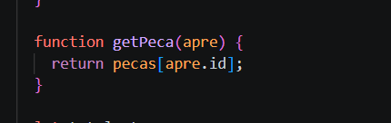
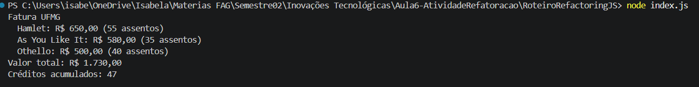

Passo 1 - Extração da função:

  
Foi criada uma função de calcular total, antes esse trecho de coódigo ficada dentro de um loo for iterando o json de peças, agora esse loop chama a função com o trecho de código.

  
Execução do programa após alteração

Passo 2 - Substituição temp por query

Foi deletada a variavel peca, e doi criada uma função getPeca; Foi alterado todos os lugares que faziam uso da variável atiga pela função nova.

  
Execução após açteração
